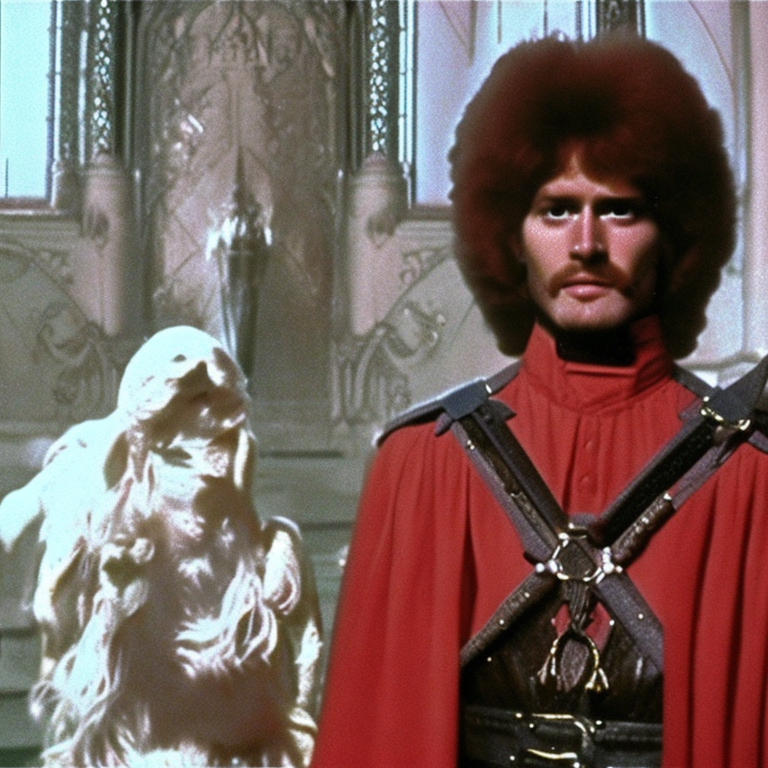

# Image Generation using Stable Diffusion Models

[](LICENSE)
[](https://savelife.in.ua/en/)

This repository contains scripts for generating images using a Stable Diffusion model and pushing them to an AWS S3 bucket. The asynchronous script is designed to run on an EC2 instance, continuously generating images based on a given prompt and uploading them to an S3 bucket.

## Setup

### Prerequisites

- Python 3.7 or later
- Pip package manager
- AWS account with S3 bucket access
- (Optional) GPU-enabled machine for faster image generation

### Installation

1. Clone the repository:

   ```bash
   git clone https://github.com/ivasik-k7/diffusion.git mlops-generations
   cd mlops-generations
   ```

2. Install dependencies:

   ```bash
   pip install -r requirements.txt
   ```

3. Set up AWS credentials:

   Ensure that you have AWS credentials configured. You can either set them as environment variables or use the AWS CLI to configure them.

   ```bash
   aws configure
   ```

4. (Optional) Install CUDA and cuDNN for GPU acceleration:

   If you have a GPU-enabled machine, you can install CUDA and cuDNN for faster image generation. Follow the instructions for your specific GPU model.

## Usage

- **-p, --prompt**: Specify the prompt for generating images (default: "DVD still from 1981 dark fantasy film Excalibur, Frozen Church, red brown toy poodle warrior, dark light, sunshine, portrait").
- **-m, --model_id**: Specify the model ID (default: "stabilityai/stable-diffusion-2-1").

- **-ni, --num_images**: Number of images to generate (default: 10).

- **-ns, --num_interfaces**: Number of interface steps to proceed on the image (Default: 10).

### Image Generation and Upload to S3

1. Run the asyncio script on an EC2 instance:

   ```bash
   python auto.py -p "Your prompt here" -m "stabilityai/stable-diffusion-2-1" -ni 1 -ns 25
   ```

   Replace `"Your prompt here"` with your desired prompt.

   This script generates images asynchronously, waits for 10 seconds, and then uploads the images to the specified S3 bucket.

### Image Generation and Local Saving

1. Run the main script for local image generation:

   ```bash
   python main.py -p "Your prompt here" -m "stabilityai/stable-diffusion-2-1" -ni 25 -ns 1
   ```

   Replace `"Your prompt here"` with your desired prompt.

   This script generates images locally and saves them in the `out` folder with a timestamped subfolder.

## Customization

- Adjust the script arguments to customize prompt, model ID, number of images, and interface steps.
- Modify S3 bucket details in the `auto.py` script (`AWS_S3_BUCKET` and `S3_FOLDER_PATH` variables).

## Notes

Images are generated based on the provided prompt using the Stable Diffusion model.
The asynchronous script (main_asyncio.py) is designed to run indefinitely on an EC2 instance.
Make sure to handle AWS credentials securely.

## Output

Generated images are saved in the "out" folder. Each run creates a new folder with a timestamp to store the images.

## Example Images





## License

This project is licensed under the MIT License - see the [LICENSE](LICENSE) file for details.
